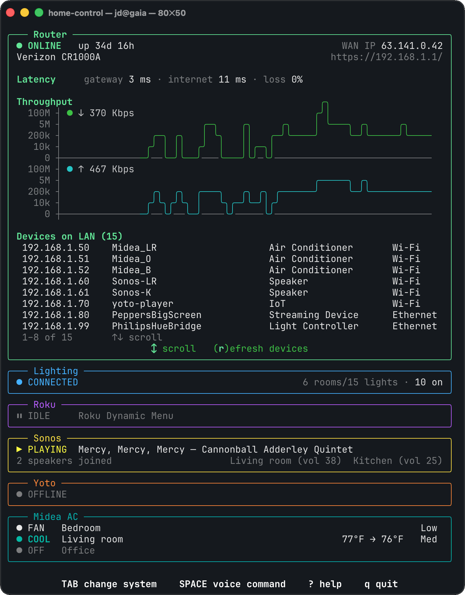

# home-control

A unified interface to control *every* device in your home. *ALL* smart devices
are supported! Whatever hardware you've got, just ask Claude to wire it up :)

  

<!-- Or, 7,000 lines of Python hallucinated by Claude that let me turn my
lights off. -->

To get a feel for the current state of agentic engineering, I built this with
Claude (Opus 4.8 and Sonnet 5) and a self-imposed rule to never look at the
actual code. Claude (`--dangerously-skip-permissions`) had free rein on a
sandbox, with some impressive results:
- Opus one-shot the voice-command mode even without access to an API key for
  testing.
- Opus also managed to reverse engineer the heavily obfuscated login process
  for my router (which I had failed to do a year prior, even with ChatGPT's
  help).

I did start Claude off with copies of my (already working) standalone TUIs for
my lights and Roku, but that was the last I considered the implementation.

Some places Claude fell short:
- Opus was generally unwilling to do basic due diligence on my offhanded
  suggestions and stubbornly stuck to them, rather than propose more sensible
  alternatives.
- Opus's design sense is still very bad. For almost every UI element, I had to
  design it character-by-character. It would even routinely misalign elements
  and not notice, despite prudently inspecting screen shots before committing.
